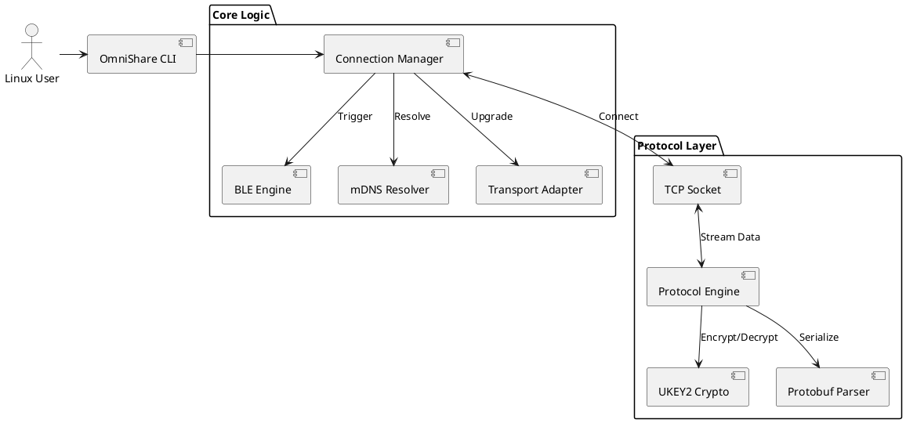
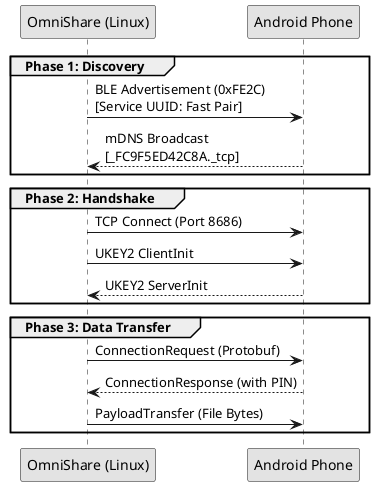

# Project Synopsis: OmniShare
**Project Title**: OmniShare - Cross-Platform Resource Sharing System via Protocol Reverse Engineering

## 1. Introduction
In today's multi-device ecosystem, file sharing between proprietary platforms (like Apple's AirDrop or Google's Quick Share) is seamless, but cross-platform interoperability remains a significant challenge. **OmniShare** is a proposed solution designed to bridge the gap between fixed Linux workstations and mobile Android devices. It aims to provide a "Zero-Install" user experience, allowing Linux users to discover and transfer files to Android phones using the phone's native built-in protocols, eliminating the need for third-party mobile applications.

## 2. Background
Most modern operating systems have closed-garden ecosystems for localized file sharing:
*   **Apple**: Uses AirDrop (AWDL + BLE).
*   **Android/ChromeOS**: Uses Quick Share (formerly Nearby Share) utilizing BLE, WebRTC, and WiFi Direct.
*   **Linux**: Lacks a native, standardized equivalent that interoperates with these mobile standards. Users currently rely on cloud services (Drive/Dropbox), cables (MTP), or third-party apps (KDE Connect, Warpinator) that require installation on both ends.

## 3. Problem Statement
Linux users face friction when transferring files to mobile devices. Existing solutions require:
1.  **Internet Connectivity**: Slow and privacy-invasive (Cloud).
2.  **Physical Cables**: Inconvenient and tied to specific ports (USB-C/A).
3.  **Dual-Side Setup**: Both the computer and the phone must have a specific app installed (e.g., KDE Connect), which breaks the spontaneity of sharing files with a friend or colleague's device.

There is no open-source, native Linux client that speaks the "language" of Android's built-in file sharing system.

## 4. Objectives and Scope

### Objectives
1.  **Reverse Engineer** the Google Quick Share protocol to understand its discovery, handshake, and transmission phases.
2.  **Develop a Linux Client** (`omni`) capable of emulating a Quick Share trusted device.
3.  **Achieve "Zero-Install" UX**: Enable file transfer to any standard Android phone without installing custom software on the phone.
4.  **Ensure Security**: Implement the UKEY2 (Diffie-Hellman) cryptographic exchange to ensure authenticated, encrypted sessions.

### Scope
*   **Target Platforms**: Linux (Sender/Receiver) and Android (Receiver/Sender).
*   **Primary Focus**: High-speed file transfer over Local Area Network (LAN) and WiFi Direct.
*   **Exclusions**: Cloud-based transfers or compatibility with iOS (AirDrop) in the first phase.

## 5. Methodology

The project adopts a research-based, iterative development methodology focusing on Protocol Reverse Engineering.

**Primary Approach: Protocol Emulation (The "Zero-Install" Path)**
This approach treats the Linux device as a verified Google endpoint.
1.  **Discovery Layer**:
    *   Use **Bluetooth Low Energy (BLE)** to broadcast "Wake Up" frames (Service UUID `0xFE2C`) containing a randomized salt to trigger the phone's high-power mode.
    *   Use **mDNS (Multicast DNS)** to discover the phone's IP address and port (Service `_FC9F5ED42C8A._tcp`) once triggered.
2.  **Handshake Layer**:
    *   Connect via TCP to the discovered endpoint.
    *   Implement **UKEY2 (User Key Exchange v2)**, an Diffie-Hellman key exchange protocol, to derive session keys and verify identity.
3.  **Data Layer**:
    *   Encapsulate file payloads in **Protobuf** (Google Protocol Buffers) `OfflineFrame` messages.
    *   Stream data over standard TCP or upgrade availability to WiFi Direct (P2P) for higher bandwidth.

**Contingency (Fallback) Plan**
If protocol encryption changes or becomes inaccessible (e.g., proprietary certificates):
*   **Alternative**: Develop a lightweight companion Android App.
*   **Mechanism**: A standard TCP socket server on the phone and a client on Linux.
*   **UX Trade-off**: Requires one-time installation, but guarantees control over the full stack.

## 6. Feasibility Study
*   **Technical**: The Quick Share protocol uses open standards (BLE, mDNS, TCP, Protobuf) disguised in proprietary logic. Open-source references (like NearDrop for macOS) prove feasibility. 
*   **Economic**: Zero cost; relies on existing hardware.
*   **Legal**: Interoperability is generally protected for reverse engineering, provided no proprietary binaries or encryption keys are stolen.

## 7. Requirements

### Hardware
*   **Workstation/Laptop**: Linux OS (Fedora/Ubuntu) with:
    *   Network Interface Card (NIC) supporting WiFi Direct (P2P).
    *   Bluetooth Adapter (BLE 4.0+ compliant).
*   **Mobile Device**: Android Phone (Android 6.0+) with Google Play Services.

### Software
*   **Language**: Rust (for memory safety, performance, and low-level networking control).
*   **Dependencies**: `bluez` (Linux Bluetooth stack), `wpa_supplicant` (WiFi control), `protobuf` compiler.
*   **Build Tools**: Cargo, OpenSSL, Clang.

8. System Design

The system is architected as a modular CLI application with distinct layers:

### System Architecture (Block Diagram)

### Protocol Interaction Flow

1.  **CLI / User Interface**: Handles user commands (`omni scan`, `omni send`).
2.  **Discovery Module**:
    *   *BLE Engine*: Manages advertisements (Gaussian vs Fast) and parsing.
    *   *mDNS Resolver*: Maps Service IDs to IP addresses.
3.  **Connection Manager**: Orchestrates the transition from Discovery -> Handshake -> Transfer.
4.  **Protocol Engine**:
    *   *Crypto*: Handles UKEY2 and Curve25519 key derivation.
    *   *Parser*: Serializes/Deserializes Protobuf messages.
5.  **Transport Adapter**: Abstracts the underlying socket (LAN vs WiFi Direct).

## 9. Modules / Features
*   **`omni trigger`**: A specialized BLE broadcaster that wakes up sleeping Android devices nearby.
*   **`omni inspect`**: A debugging tool to decode raw BLE packets and GATT services.
*   **`omni connect`**: Automates the full handshake flow (Trigger -> Resolve -> Authenticate).
*   **`omni send [file]`**: The core feature to transmit data.

## 10. Outcome
The final deliverable will be a Rust-based command-line tool (potentially wrapped in a GUI) that allows a Linux user to right-click a file and select "Share to Android," instantly detecting nearby phones without prior setup.

## 11. Timeline

*   **Weeks 1-2**: Research & Environment Setup (Rust, BlueZ, wpa_supplicant). **[Completed]**
*   **Weeks 3-4**: BLE Discovery & Advertisement reverse engineering. **[Completed]**
*   **Weeks 5-6**: Network discovery (mDNS) and TCP Connection establishment. **[In Progress]**
*   **Weeks 7-8**: Cryptographic Handshake (UKEY2) implementation.
*   **Weeks 9-10**: Payload transmission and file reassembly.
*   **Weeks 11-12**: Optimization, UI Polish, and Documentation.
