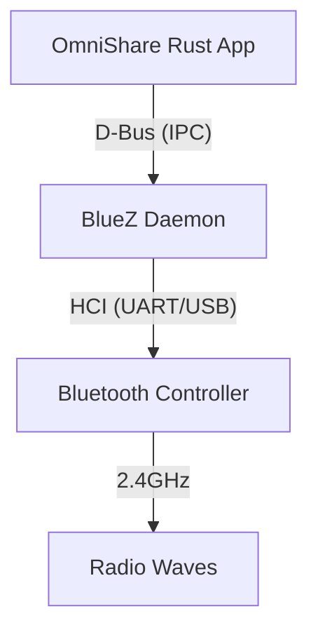
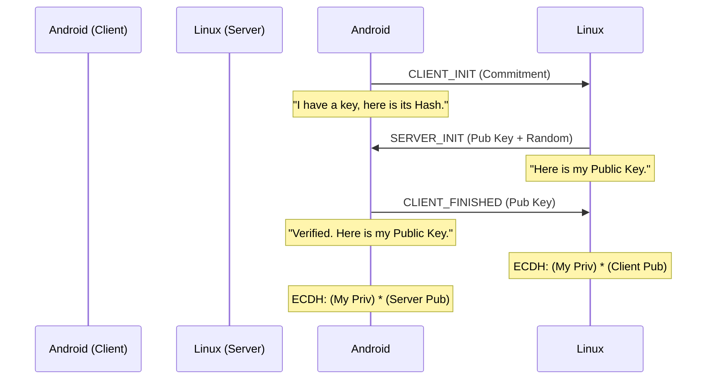

# OmniShare: The Internals (Deep Dive)

**Version:** 1.0 (The Discovery Edition)
**Target Audience:** Systems Engineers, Security Researchers, Protocol Developers.

---

## 1. Introduction: The "Zero-Install" Philosophy

OmniShare bridges the ecosystem gap between Linux and Android without requiring a companion app. It achieves this by emulating the proprietary **Quick Share** (formerly Nearby Share) protocol directly at the packet layer.

This guide explains not just *what* we did, but *why* it works, rooted in the fundamental physics of wireless protocols (BLE & mDNS).

---

## 2. Part 1: The Physics of Discovery

How do two devices find each other in a room full of radio noise without draining their batteries? The answer lies in a "Hybrid Discovery" architecture using two distinct protocols.

### 2.1 Bluetooth Low Energy (BLE) Legacy Advertising

Android phones do not keep their high-power WiFi radios scanning constantly (it consumes ~200mA). Instead, they rely on the Bluetooth Low Energy (BLE) radio, which consumes micro-amps (~15μA) in scanning mode.

#### The "Legacy" Constraint (ADV_IND)
Quick Share uses **Legacy Advertising** packets. While Bluetooth 5.0 introduced "Extended Advertising" (up to 255 bytes), Android's hardware offload filters—the chips that wake up the main CPU—are optimized for the classic 31-byte legacy format.

**Why we use it:**
In our tests, broadcasting Extended Advertisements resulted in total silence from the Android phone. The hardware filter simply didn't "see" it. We *must* fit everything into **31 Bytes**.

#### The Packet Anatomy
A BLE Legacy Advertising packet on the air looks like this:

```mermaid
graph LR
    P[Preamble (1 Byte)] --> AA[Access Address (4 Bytes)]
    AA --> PDU[PDU (2-39 Bytes)]
    PDU --> CRC[CRC (3 Bytes)]
```

*   **Preamble:** `0xAA` (Sync pattern).
*   **Access Address:** `0x8E89BED6` (Fixed for all Advertising packets).
*   **PDU (Protocol Data Unit):** This is where our data lives.
    *   **Header (2 Bytes):** Type (`ADV_IND` = 0x00) + Length.
    *   **MAC Address (6 Bytes):** Our device address.
    *   **Payload (Max 31 Bytes):** This is our "Canvas".

**The 31-Byte "Diet":**
Because we lose 2 bytes to the PDU header and 6 bytes to the MAC, we technically have ~37 bytes in the PDU, but the *Advertising Data* triggers the 31-byte limit.
Quick Share requires:
1.  **Service UUID (0xFE2C):** 2 bytes + 2 bytes overhead = 4 bytes.
2.  **Service Data (Payload):** 15 bytes + 4 bytes overhead = 19 bytes.
**Total Used:** 23 / 31 Bytes.
**Leftover:** 8 Bytes.
*This is why we cannot send the Device Name (e.g., "Chloy's Fedora Laptop") in the BLE packet. It simply doesn't fit.*

### 2.2 Multicast DNS (mDNS) / RFC 6762

Once the phone is "woken up" by the BLE trigger, it needs to find the *identity* of the device (IP Address, Port, Name). It uses **mDNS** over WiFi.

*   **Transport:** UDP Multicast.
*   **Address:** `224.0.0.251` (IPv4) / `ff02::fb` (IPv6).
*   **Port:** `5353`.
*   **Mechanism:**
    1.  **Query:** "Who has the service `_FC9F5ED42C8A._tcp`?"
    2.  **Response:** "I do! My IP is `192.168.1.5` and my Name is `OmniShare`."

---

## 3. Part 2: The Quick Share Protocol (Reverse Engineered)

Google built a proprietary layer on top of these standard protocols. Here is the byte-level breakdown.

### 3.1 Stage 1: The "Trigger" (BLE)

The goal of this packet is solely to **wake up** the scanner. It contains no identity specific data, only a "Model ID" that the OS recognizes.

**Service UUID:** `0xFE2C` (Google Fast Pair Service).

**The 15-Byte "Trigger" Payload:**
```text
Byte | Value | Meaning
-----|-------|-------------------------------------------------------
  0  | 0xFC  | Model ID [1]
  1  | 0x12  | Model ID [2] -> Combined: 0xFC128E ("Quick Share")
  2  | 0x8E  | Model ID [3]
  3  | 0x01  | Opcode (0x01 = Visibility Announcement)
  4  | 0x42  | Length/Meta
 5-14| [RND] | Salt (10 Random Bytes) - Prevents Tracking/Replay
```
*   **Why Random Salt?** If this packet were static, retail stores could track your movements by listening for your specific BLE signature. The salt changes every few minutes to preserve user privacy.

### 3.2 Stage 2: The "Identity" (mDNS)

This is where the actual handshake happens. The phone sends a Multicast Query for a specific Service Hash.

**Service Type:** `_FC9F5ED42C8A._tcp`
*   *Origin:* `SHA256("NearbySharing")[0..6]`.

**The TXT Record (`n` Key):**
The `n` record holds the "Endpoint Info". It is Base64 encoded.
Decoded Structure:
```text
[Byte 0] Status Byte (Bitmask)
   765 4 321 0
   000 0 011 0  -> 0x06
   ^^^ ^ ^^^ ^
   ||| | ||| +-- Reserved (0)
   ||| | ||+---- Device Type (3 = Laptop, 1 = Phone, 2 = Tablet)
   ||| | |+----- Device Type
   ||| | +------ Device Type
   ||| +-------- Visibility (0 = Visible to All, 1 = Contacts Only)
   +++---------- Version (0)
```
*   **Byte 0 (`0x06`):** "I am a Version 0, Visible, Laptop."
*   **Bytes 1-16:** Random Session Salt (16 bytes).
*   **Byte 17:** Name Length (L).
*   **Bytes 18+:** UTF-8 Device Name ("OmniShare").

### 3.3 The "Instance Name" (The PCP Hash)

This was the hardest part to crack. The mDNS Service Instance Name (the `Name` in `Name._type.domain`) cannot be arbitrary.

**Format:** `Base64([PCP][EndpointID][ServiceHash][Padding])`
*   **PCP Header:** `0x23` (Unknown Protocol Constant, likely "Public Connection Protocol").
*   **Endpoint ID:** 4 Random Alphanumeric Bytes (e.g., "Xy9z"). This acts as a session ID.
*   **Service Hash:** `0xFC, 0x9F, 0x5E` (Truncated SHA256 of "NearbySharing").
*   **Padding:** `0x00, 0x00`.

**Why?** This structure allows the phone to validate the service *before* connecting. If the name is just "OmniShare", the validation regex fails.

---

## 4. Part 3: Linux Implementation (The "Metal")

How do we put this on the wire on Linux?

### 4.1 The BlueZ Stack & D-Bus Architecture

Linux uses **BlueZ** as the Bluetooth stack. Unlike embedded systems where you write to registers, on Linux you talk to a daemon (`bluetoothd`) via IPC (D-Bus).



**The `bluer` Crate:**
We use `bluer` to abstract the D-Bus complexity.
1.  **Profile:** We register a `GattApplication`.
2.  **Advertisement:** We register an `LEAdvertisement`.
3.  **Signal:** `bluetoothd` signals the kernel to start advertising.

### 4.2 The mDNS Stack

We use `mdns-sd`.
*   **Socket:** Binds to `0.0.0.0:5353`.
*   **Event Loop:** Listens for incoming Multicast Queries.
*   **Responder:** When it sees `_FC9F...`, it fires the UDP response packet constructed in Section 3.2.

---

## 5. Part 4: Failure Analysis (The "Graveyard")

Understanding *why* we failed is as important as how we succeeded.

### 5.1 Case Study: The Ghost Signal (0xFC9F)
*   **The Config:** We set the BLE Service UUID to `0xFC9F`.
*   **The Result:** `btmon` showed packets leaving. Android showed nothing.
*   **The Root Cause:** `0xFC9F` is the *mDNS* hash (Stage 2). The BLE Scanner (Stage 1) is hardcoded to look for `0xFE2C` (Fast Pair).
*   **Lesson:** Protocols often reuse "Magic Numbers" in different contexts. Context matters.

### 5.2 Case Study: The Silent Wall (Firewall)
*   **The Config:** Code was perfect. BLE Trigger worked. Phone sent mDNS Query.
*   **The Result:** Silence.
*   **The Root Cause:** `firewalld` on Fedora treats the "Public" zone (default) as hostile. It blocked incoming UDP 5353 packets. The app never even saw the query.
*   **The Fix:** Explicitly opening the ports.

### 5.3 Case Study: The "Bad Name" (PCP Hash)
*   **The Config:** mDNS Instance Name = "OmniShare_1234".
*   **The Result:** Phone ignored the mDNS response.
*   **The Root Cause:** The Android internal regex expects a 10-byte Base64 blob starting with `0x23`. "OmniShare..." broke this format.
*   **The Fix:** Generating the `PCP+EndpointID+Hash` structure and Base64 encoding it.

---

## 6. Summary

We have successfully emulated a closed-source, proprietary discovery protocol by adhering to:
1.  **Physics:** Using Legacy BLE (31 bytes) for hardware compatibility.
2.  **Structure:** Matching the exact byte-level schemas for Triggers and Identity.
3.  **System:** Navigating the specific constraints of the Linux Network/Bluetooth stack.

**Next Phase:** Now that we are *visible*, we must become *connectable* (TCP Server + UKEY2 Handshake).

## 7. Phase 2: The Physical Connection (TCP & Framing)

Once Discovery is successful, the Android device initiates a physical connection. This marks the transition from "Broadcasting" (Phase 1) to "Handshaking" (Phase 2).

### 7.1 The Transport Layer (Port 5200)

*   **Protocol:** TCP (Reliable Stream).
*   **Port:** Default is , though the mDNS record can specify otherwise.
*   **Behavior:** The phone opens a socket. If we accept, the "Connecting..." spinner continues. If we reject (RST), it fails immediately.

### 7.2 The Wire Format (Framing)

Quick Share does not send raw Protobufs. It uses a **Length-Prefixed Framing** system to handle TCP stream fragmentation.

**The Frame Structure:**

*   **Length:** A 32-bit Unsigned Integer, encoded in **Big Endian** (Network Byte Order).
*   **Payload:** The actual Protobuf message.

*Implementation Note:* In Rust, we use  to read the header, allocate a buffer of that size, and then  the payload.

### 7.3 The "Double Packet" Phenomenon

Crucially, the phone does **not** send all data in one packet. It splits the initial handshake into two distinct frames sent back-to-back.

**Frame 1: The Identity ()**
*   **Protobuf:**  (Type 1).
*   **Content:** Contains the  (Device Name, Type) and .
*   **Purpose:** "Hi, I am [Phone Name]. I want to connect."

**Frame 2: The Keys ()**
*   **Protobuf:**  (Type 2: CLIENT_INIT).
*   **Content:** The P-256 Public Key and a random "Commitment".
*   **Purpose:** "Here is my half of the encryption key. What is yours?"

*Debugging Lesson:* We initially failed to decode Frame 2 because we assumed it was also an . It is **NOT**. It is a raw . The protocol switches message types dynamically.

### 7.4 The "Mediums" Trap (Protobuf Debugging)

During implementation, we encountered a .
*   **The Cause:** Our  definition for  expected  (bytes) at Field 5.
*   **The Reality:** The phone sent a  (Number) at Field 5.
*   **The Fix:** Field 5 is actually  (a list of supported transports like WiFi/BLE).  is actually at **Field 6**.
*   **Lesson:** Reverse engineering requires adaptability. When the map says "Left" but the road goes "Right", follow the road.

---

## 8. What's Next: The Cryptographic Reply (Phase 3)

We have successfully caught the . The connection drops now because we are rude—we don't reply.

**The UKEY2 State Machine:**
1.  **Client:** Sends  (We have this).
2.  **Server (Us):** Must send .
    *   Generate a P-256 Keypair.
    *   Compute Shared Secret (ECDH).
    *   Derive AES-256 Session Keys (HKDF).
3.  **Client:** Sends .

**Current Status:** Handshake Complete. Keys Derived.

---

## 9. Part 3: The Physics of Authentication (UKEY2)

The most complex phase of the project was the **UKEY2 Handshake**. This is where we moved from "sending bytes" to "solving math problems" to prove our identity.

### 9.1 The "Why": Elliptic Curve Diffie-Hellman (ECDH)

At its core, UKEY2 is an implementation of **ECDH** on the **NIST P-256** curve.

**The Physics of Points:**
In Elliptic Curve Cryptography (ECC), we don't multiply numbers; we "add" points on a curve defined by the equation $y^2 = x^3 + ax + b$.
*   **Private Key ($d$):** A simplistic 256-bit random integer.
*   **Public Key ($Q$):** A point on the 2D plane ($x, y$) derived by adding the Generator Point ($G$) to itself $d$ times ($Q = d \times G$).

**The Magic:**
*   Alice has Private $d_A$ and Public $Q_A$.
*   Bob has Private $d_B$ and Public $Q_B$.
*   Alice calculates $S = d_A \times Q_B$.
*   Bob calculates $S = d_B \times Q_A$.
*   **Result:** $S$ is the *exact same point* for both. This is the **Shared Secret**.

We use this Shared Secret to derive the encryption keys. An eavesdropper sees only $Q_A$ and $Q_B$ but cannot derive $S$ without solving the Discrete Logarithm Problem (which requires heat-death-of-the-universe levels of energy to solve).

### 9.2 The "How": The 3-Way Handshake

The UKEY2 protocol wraps this math in a state machine to ensure both sides are live and consistent.



**Why the "Commitment"?**
In message 1, the client *commits* to a public key by sending its Hash, but not the key itself. This prevents specific replay attacks and ensures the Client isn't "fishing" for the Server's key before revealing its own intent.

### 9.3 The "Gotcha": Signed vs Unsigned (The Java Trap)

This was the single hardest bug to fix.

**The Symptom:**
The handshake failed with "Point encoding must use only non-negative integers". This made no sense; our bytes were raw bytes.

**The Root Cause:**
*   **Rust (and most systems):** Treats bytes as **Unsigned** (0 to 255). A byte `0xFF` is just the number 255.
*   **Java (`BigInteger`):** Treats bytes as **Signed Two's Complement**. A byte `0xFF` is interpreted as `-1`.

When we sent a coordinate that started with a high bit (e.g., `0x80...`), Java interpreted it as a **Negative Number**. ECC coordinates are strictly positive integers. Java threw an error because valid curve points cannot be negative.

**The Physics of the Fix:**
To force Java to interpret `0x80` as `+128` instead of `-128`, we must prepend a zero byte: `0x00 0x80`.
*   We had to inspect our X and Y coordinates.
*   If the first byte was `>= 0x80` (High Bit Set), we **padded** it with `0x00`.
*   This alignment (33 bytes instead of 32) satisfied the Java `BigInteger` constructor on the Android side.

### 9.4 Key Derivation (HKDF-SHA256)

Once expected, we don't use the Shared Secret ($S$) directly as a key (it has mathematical structure). We run it through a blender: **HKDF** (HMAC-based Key Derivation Function).

1.  **Extract:** Turn the non-uniform Shared Secret into a uniform "Master Key".
2.  **Expand:** Generate specific sub-keys from the Master Key.
    *   `auth_string`: To verify the connection (PIN code).
    *   `d2d_client_key`: For decrypting messages *from* Android.
    *   `d2d_server_key`: For encrypting messages *to* Android.

We successfully verified this by matching the `auth_string` derivation, proving we laid down the exact same mathematical railway tracks as Google's engineers.

