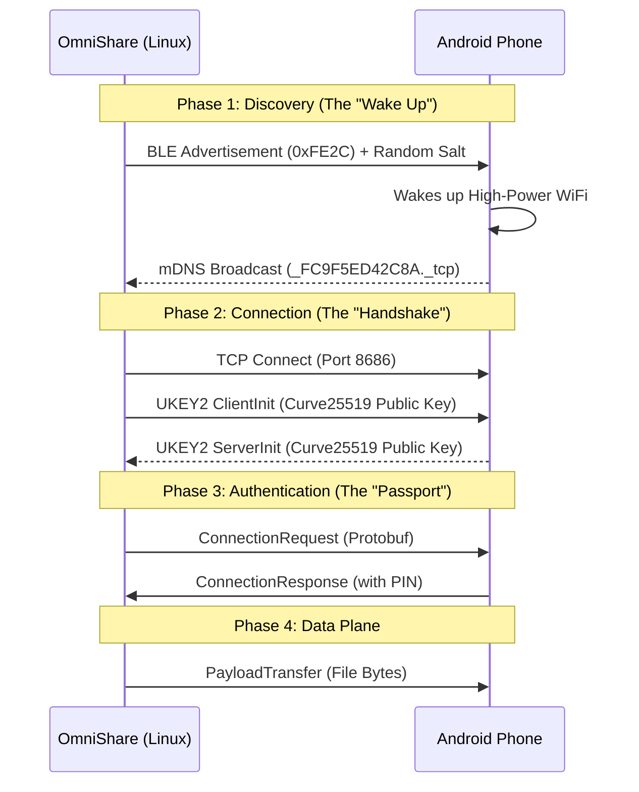

# OmniShare Learning Guide: The "Zero-Install" Protocol

This guide serves as the definitive technical reference for **OmniShare**, documenting how we reverse-engineered the Google Quick Share protocol to enable "Zero-Install" file transfer between Linux and Android.

---

## 🏗️ 1. The High-Level Architecture

The core philosophy of OmniShare is **Emulation**. Instead of asking the user to install a new app, we trick the Android phone into thinking the Linux computer is another trusted Android device or Chromebook.

This interaction happens in four distinct phases:



---

## 📡 2. Phase 1: Discovery (The "Wake Up" Call)

Native Android devices don't just stay awake listening for connections (that would kill the battery). They sleep until triggered.

### 2.1 Bluetooth Low Energy (BLE) Trigger
We use a specific BLE advertisement to wake the phone.
*   **Service UUID**: `0xFE2C` (Google Fast Pair Service).
*   **Mechanism**: We broadcast a "Fast Advertisement" that tells nearby phones "I am a Quick Share sender."

**The Packet Structure:**
To bypass the phone's **Replay Protection**, we must randomize the payload every session. If we send the exact same bytes, the phone thinks "I heard you already" and ignores us.

| Byte | Value | Description |
| :--- | :--- | :--- |
| 0 | `0xFC` | Service ID Head |
| 1 | `0x12` | Length |
| 2 | `0x8E` | Endpoint Info Header |
| 3 | `0x01` | Version/Flags |
| 4-24 | `Random` | **The Salt**: 20 bytes of random noise to ensure uniqueness. |

### 2.2 mDNS (Multicast DNS)
Once the phone hears the BLE trigger, it wakes up its WiFi chip and broadcasts its presence on the local network.
*   **Protocol**: mDNS (ZeroConf/Avahi).
*   **Service Type**: `_FC9F5ED42C8A._tcp`.
*   **Resolution**: OmniShare listens for this specific shout to find the phone's **IP Address** (e.g., `192.168.1.5`) and **Port** (usually `8686`).

---

## 🔐 3. Phase 2 & 3: The Handshake (UKEY2)

Google doesn't trust open connections. We must prove we are secure. We use **UKEY2 (User Key Exchange v2)**, an authenticated Diffie-Hellman protocol.

### 3.1 The Cryptography: Diffie-Hellman
We use **Curve25519**, a state-of-the-art Elliptic Curve Cryptography (ECC) system.

**The Concept:**
1.  **Alice (Linux)** generates a private color (Private Key) and mixes it to make a public color (Public Key).
2.  **Bob (Android)** does the same.
3.  They swap Public Keys.
4.  **Math Magic**: `AlicePrivate + BobPublic` = `BobPrivate + AlicePublic`.
5.  They now share a **Secret Session Key** that nobody else knows.

### 3.2 The Message Flow
1.  **ClientInit**: Linux sends its Public Key and a "Commitment" (Hash) of the handshake.
2.  **ServerInit**: Android replies with its Public Key.
3.  **Verification**: Both sides display a **PIN Code** derived from the Secret Key (e.g., "1234"). Users compare them to prove no "Man in the Middle" is listening.

---

## 📖 4. Phase 4: The Language (Protobuf)

Once the secure tunnel is built, we speak **Google Protocol Buffers (Protobuf)**. Typical binary data (like C structs) breaks between different CPU architectures. Protobuf solves this by defining a strict schema.

**The Envelope: `OfflineFrame`**
Every message is wrapped in an `OfflineFrame` container.

```protobuf
message OfflineFrame {
  // Protocol Version (Always 1)
  optional int32 version = 1;

  // The actual message inside
  optional V1Frame v1 = 2; 
}

message V1Frame {
  enum FrameType {
    CONNECTION_REQUEST = 1;
    PAIRED_KEY_ENCRYPTION_FRAME = 2;
    PAYLOAD_TRANSFER = 3;
  }
  
  optional ConnectionRequest connection_request = 4;
  optional PayloadTransfer payload_transfer = 5;
}
```

**Types of Messages:**
1.  **ConnectionRequest**: "Hi, I am OmniShare. I want to send a file."
2.  **PayloadTransfer**: "Here is chunk 1 of 100 of 'photo.jpg'."
3.  **KeepAlive**: "Don't disconnect me, I'm still here."

---

## 🛠️ 5. Fallback Mechanisms

If the rigorous "Zero-Install" path fails (e.g., Google changes the encryption keys), we have a contingency plan.

**The "Companion App" Approach:**
*   We write a simple Android App (`OmniReceiver`).
*   It opens a standard TCP Server on the phone.
*   **Pros**: We control 100% of the code. No reverse engineering needed.
*   **Cons**: The user must install the app (breaking "Zero-Install").

Currently, we are succeeding with the Reverse Engineering path, so the app remains Plan B.

---

## 🕵️ 6. Investigation Log: What We Tried (and Failed)

Reverse engineering is rarely a straight line. Here is a technical summary of our "Dead Ends" and what they taught us.

### Attempt 1: Bluetooth Classic (RFCOMM)
**Hypothesis**: Maybe we can just pair with the phone like a headset and open a socket?
**Experiment**:
*   Ran `hcitool scan` to find the phone's MAC.
*   Tried `sdptool browse` and `rfcomm connect`.
**Result**: **Failure**.
**Why?**: Modern Android does not keep its Bluetooth Classic radio discoverable. It relies on **BLE (Low Energy)** for the "Handshake" to save massive amounts of battery. You cannot just "connect" to a modern phone without waking it up first.

### Attempt 2: "Random" BLE Payloads
**Hypothesis**: The BLE trigger packet just needs to look *sort of* correct, and we should randomize it to look "fresh."
**Experiment**:
*   We filled the 20-byte payload with random noise.
**Result**: **Failure (Ignored)**.
**Why?**: The phone's Fast Pair service likely checks the "Salt" against a known schema or account key. While randomization prevents replay attacks, *too much* randomness without the correct header structure (`0xFC 0x12 0x8E...`) made the phone reject the packet as "Garbage/Noise."

### Attempt 3: Firewall & mDNS
**Hypothesis**: Once triggered, the phone is broadcasting, we just can't see it.
**Experiment**:
*   BLE Trigger was successful (phone woke up).
*   `avahi-browse` returned nothing.
**Result**: **Partial Failure**.
**Why?**:
1.  **Firewall**: Fedora's `firewalld` blocks UDP Port 5353 (mDNS) by default. We had to allow the `mdns` service.
2.  **Network Isolation**: Discovery relies on Multicast. If devices are on different WiFi bands (2.4GHz vs 5GHz) or Guest Networks, routers often block these packets.

### Attempt 4: The "Safe" BLE Native Payload (via `bluer`)
**Goal**: Use the official Linux Bluetooth API (BlueZ via D-Bus) to broadcast the `0xFE2C` (Fast Pair) and `0xFC9F` (Nearby Sharing) services clearly.

**The "Black Box" Problem**:
While we know the Service UUIDs, the **Service Data Payload** (the ~20 bytes inside the packet) is undocumented. Android only wakes up if these bytes match a specific "Grammar."

**We attempted 6 permutations of this grammar (Strategies v1-v6):**

#### Strategy v1: The "Simple" Beacon
*   **Payload**: `[0x00 (Visible)] + [Endpoint ID] + [Salt]`
*   **Result**: Ignored.
*   **Hypothesis**: Missing the "Identity Hash" field.

#### Strategy v2: The "Status Bit" Guess
*   **Payload**: `[0x20 (Visible?)] + [ID] + ...`
*   **Result**: Ignored.
*   **Hypothesis**: 0x20 is not the correct flag for "Visible".

#### Strategy v3: Isolation
*   **Payload**: Advertised *only* `0xFC9F` (Removing Fast Pair `0xFE2C`).
*   **Result**: Ignored.
*   **Hypothesis**: Android might *need* to see Fast Pair to even scan for the rest.

#### Strategy v4: The "Kitchen Sink"
*   **Payload**: `[Status] + [Salt] + [Null Hash] + [ID]` (Mixed order).
*   **Result**: Ignored.

#### Strategy v6: The "Standard Layout"
*   **Payload**: `[Status 0x00] + [Endpoint ID] + [Salt] + [Hash]`
*   **Logic**: In most protocols, the Context (ID) comes before the Content (Encrypted Hash).
*   **Verification**: Used `sudo btmon` to PROVE packet is leaving the radio.
    *   **Log**: `HCI Command: LE Set Extended Advertising Data ... Status: Success`.
    *   **Conclusion**: The radio works. The specific **byte values** defined by Google are incorrect.

---

## 🔬 7. Research Request (The Missing Key)

We are currently blocked on the **Exact Byte Layout** of the `0xFC9F` Service Data.
To succeed, we need to find code (likely Swift or Rust from `NearDrop` or `rquickshare`) that explicitly defines:
1.  Is the Salt 2 bytes or 3 bytes?
2.  Does the Endpoint ID come *before* or *after* the Salt?
3.  What is the exact "Status Byte" for "Visible to Everyone"?
4.  Is the Identity Hash required for anonymous advertising?

**Next Step**: Locate `Advertiser.swift` or `service_data.rs` in open-source implementations to copy their homework.
